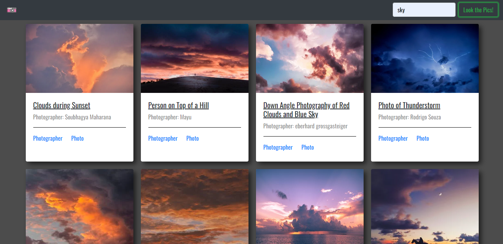

# Simple sites

A repository for simple websites for Web studies

### Author(s)
- [ArthurMtTh](https://github.com/ArthurMtTh)

 

# Projects

## PexelsApi

> Bootstrap framework stylized website which returns images with jquery and pexels api

## Api's | frameworks | Libs

- [Pexels Api](https://www.pexels.com/pt-br/api/)
- [Bootstrap](https://getbootstrap.com/)
- [Jquery](https://getbootstrap.com/)

---